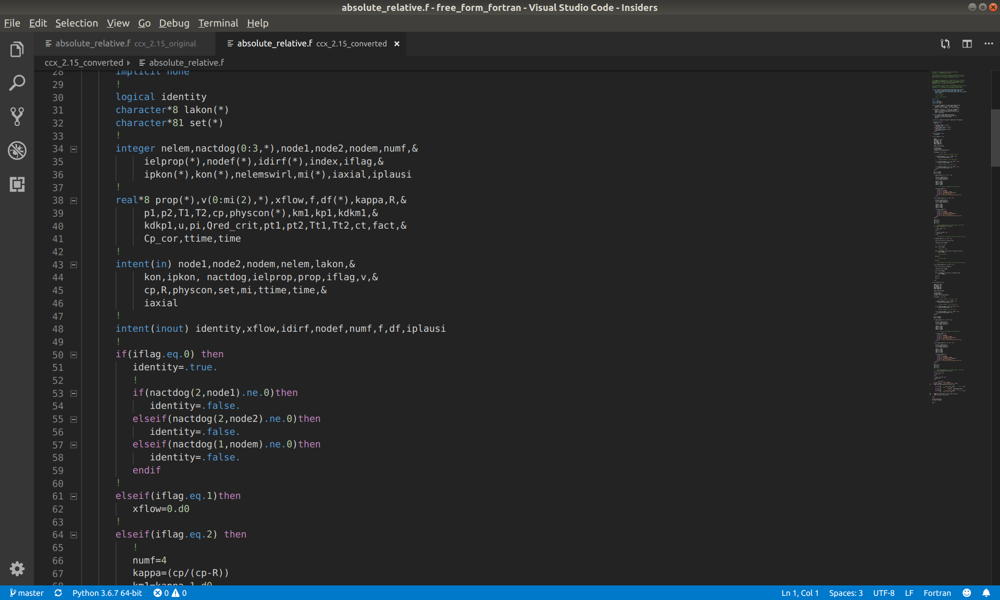

© Ihor Mirzov, December 2019  
Distributed under GNU General Public License v3.0

  

# Fortran code converter for Calculix 2.15

Converts old Calculix Fortran 77 code to the one with free form. Shifts comments and continuation marks for better code folding. Compiles all fortran sources with -ffree-form flag. Takes files to be compiled from Makefile.inc. The script will process sources from folder *ccx_2.16* and put them into *ccx_2.16_ffree_form*. Now those sources are ready for the *make* command. Refer to the official manual instructions how to build. To understand the difference in sources see images below.

Before conversion:  

After conversion - code folding works like a charm:  

  

# How to use

Default usage is:

    python3 free_form_fortran.py

Also you can explicitly point existing folders to process:

    python3 free_form_fortran.py original_sources_dir converted_sources_dir

  

# Your help

- Simply use this software and ask questions.
- Share your models and screenshots.
- Report problems by [posting issues](https://github.com/imirzov/ccx_free_form_fortran/issues).
- Do something from the [TODO-list](#TODO).

  

# TODO

- All done :)