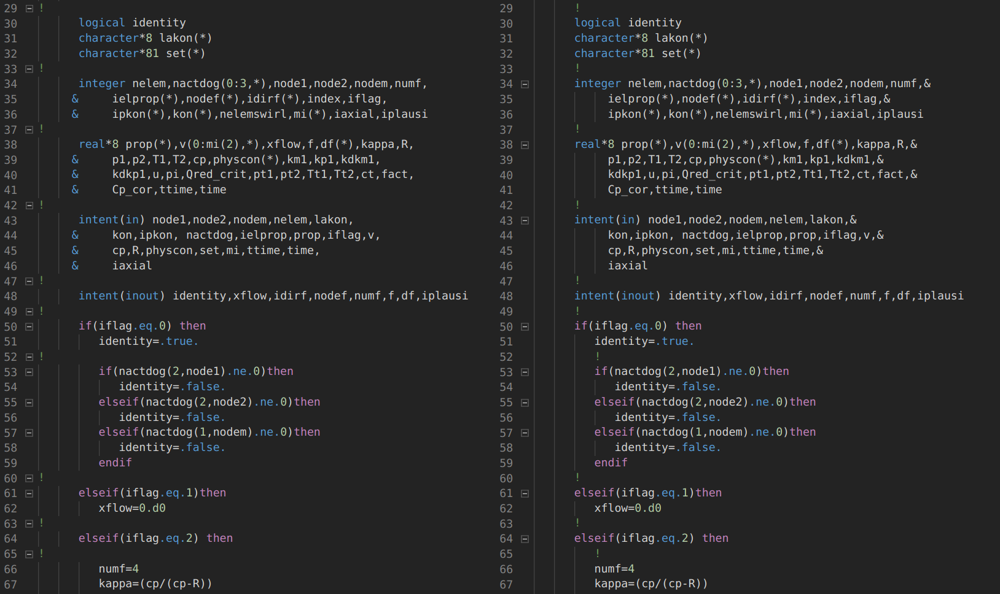

© Ihor Mirzov, August 2020  
Distributed under GNU General Public License v3.0  
CalculiX, libraries ARPACK and SPOOLES have their own licenses

  

---

[Downloads](#downloads) |
[How to use](#how-to-use) |
[Screenshot](#screenshot) |
[Your help](#your-help)

---

  

# CalculiX CrunchiX 2.16 with free form Fortran

Script [ccx_fff.py](./ccx_fff.py) converts old Fortran 77 code to the one with free form. Shifts comments and continuation marks for better code folding. Compiles all Fortran sources with *-ffree-form* flag. Takes files to be compiled from *Makefile.inc*. To understand the difference in sources see [screenshot](#screenshot).

The script has already converted original CalculiX CrunchiX sources from folder *src* and put them into:

- [ccx_linux/src_fff](./ccx_linux/src_fff)
- [ccx_windows/src_fff](./ccx_windows/src_fff)

Also those folders include compiled *ARPACK* and *SPOOLES* libraries.

Converted CalculiX CrunchiX sources are compiled with multithreading using *Makefile_MT*.

  

# Downloads

Release version of binaries, converted and compiled sources together with original code could be downloaded from [the releases page](./releases).

Compiled with multithreading CalculiX CrunchiX binary is here:

- [for Linux](./ccx_linux/src_fff/ccx)
- [for Windows](./ccx_windows/src_fff/ccx.exe)

Windows version may need [Cygwin dlls](./cygwin_dlls.zip) to be placed in a working directory to run a calculation.

  

# How to use

Default usage of the converter is:

    python3 ccx_fff.py

Also you can explicitly point existing folders to process:

    python3 ccx_fff.py ./src ./ccx_linux/src_fff
    python3 ccx_fff.py ./src ./ccx_windows/src_fff

  

# Screenshot

Before conversion vs. after conversion - code folding works like a charm:  

  

# Your help

- Simply use this software and ask questions.
- Report problems by [posting issues](./issues).
